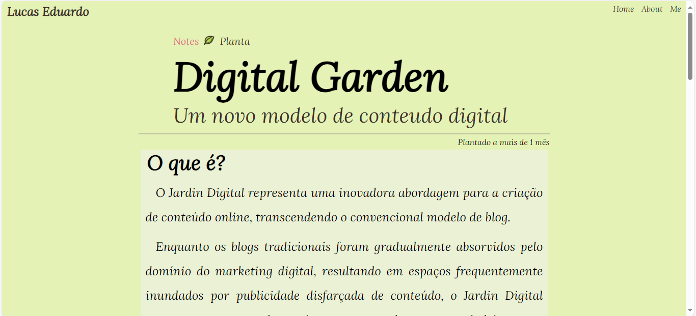

# Welcome to My Digital Garden:
Esse projeto é onde crio meu [*Jardim Digital*](https://lceduardo.github.io/Digital-Garden/).

## Ideia: 
Ao explorar o Jardim Digital de [Maggie Appleton](https://maggieappleton.com/), surgiu a inspiração para desenvolver o meu próprio. Este projeto é fundamentado, é claro, na obra dela, bem como em algumas outras referências que pesquisei para obter uma compreensão abrangente sobre como abordar essa criação.

### Design: 
Considerei a ideia de criar meu jardim com uma temática intrínseca, representando um jardim em sua essência. Para isso, escolhi cores como verde e marrom para evocar a presença de grama, terra, flores e plantas. Incorporei diferentes variedades de sementes, plantas e flores, cuidadosamente selecionadas para simbolizar a progressão do tempo e o processo criativo que explorei em uma das seções de links.

### Functions:
Em relação à funcionalidade do site, a abordagem foi bastante básica. Desenvolvi um código que analisa de maneira específica a quantidade de links que eu criei, representando, assim, a variedade de tópicos ou temas abordados, e exibe essa contagem de forma demonstrativa.

Outra funcionalidade está presente na página onde explano o conceito de Jardim Digital. Nessa seção, implementei um mecanismo que adiciona uma seta ao passar o mouse sobre o elemento 'Notes', que funciona como um link para retornar à página principal. Além disso, na mesma página, integrei um recurso para criar um 'tooltip', revelando uma característica relacionada à quantidade de esforço e trabalho investidos no projeto.

## Imagem do Site Digital Garden:
Infelizmente não pode ser acessado pelo GitHub pages, mas se alguém tiver uma solução podem ficar a vontade e enviar para mim. 

